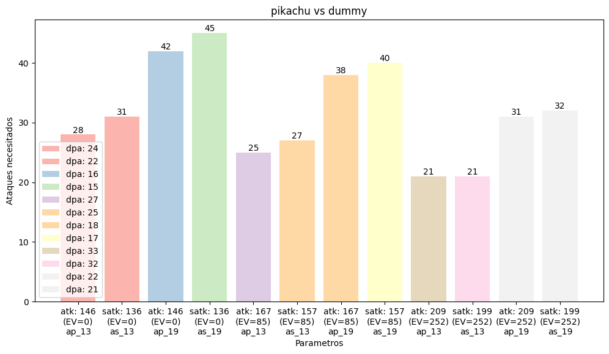

# PokeTournament
Project to Systems modeling

## Contactos

Ariel Rodolfo Zarmudio Romero - zamromxd@gmail.com

## Licencia

PokeSearch es distribuido bajo la licencia [GNU](https://es.wikipedia.org/wiki/GNU_General_Public_License).

## Descripción

PokeTournament esta planteado para ser un modelo de como sucedería un torneo de Pokémon al simular combates entre los equipos que el usuario brinde como valores iniciales para hacer simulaciones con equipos reales o "preestablecidos" (como los que ya tienen NPC de los juegos) para distintos propositos.

## Justificación

Se encontró que es complicado para jugadores que no han tenido un acercamiento a los juegos estilo RPG o TBS tienen ciertas dificultades en entender el sistema de combate o sus relaciones entre 'stats' con respecto a los ataques y pokemon por lo que se desarrolla este modelo planeando que para estos usuarios sea mas sencillo tener este acercamiento hacia los pokemon y sus relaciones para que no tengan problemas para iniciar a jugar la saga principal de Pokémon

## Características

- **Torneo dinamico:** Dado 2^n equipos de Pokémon dados por el usuario, simular combates dobles usando de manera estrategica sus movimientos para vencer al equipo enemigo de manera procedural hasta obtener un vencedor del torneo. El torneo con los mismos equipos deberían resultar distintos tan solo con ordenar de manera distinta los pokemon iniciales de cada equipo.

- **Comportamiento semirealista (con respecto a los juegos):** El modelo debería actuar de manera estrategica con respecto a solo la informacion que tiene, es decir, actuara de manera estrategica solo hacía los pokemon que ha visto y solo con movimientos que realmente tiene 'aprendidos' el pokemon .

- **Pokemon parametrizados:** El modelo puede aceptar parametros para modificar los pokemon creados mientras los parametros respeten las reglas. Esto puede ser desde sus IVs, EVs e incluso sus ataques (de manera posterior se podrian agregar naturalezas o habilidades).

- **Estadisticas de ataque y defensa:** El modelo podrá brindar estadisticas en graficos sobre la cantidad de golpes que resistirian antes de morir o cuantos deberian acertar sobre el oponente para sacarlo del combate. 

## Hipotesis

Se planea extender este apartado de manera posterior\*

## Desarrollo

### Estadisticas: 
Para iniciar el apartado de las estadisticas se planteó la cuestión "¿Como determino de manera general como sería la mejor manera de crear un pokemon?", es una duda que nace de que los todos los pokemon son virtualmente diferentes porque tienen distintos parametros tales como IVs (Individual Values), EVs (Effort Values) y naturaleza. Por cuestiones de simpleza se eliminará de la ecuacion a la naturaleza por lo que aun nos quedan los IVs y EVs donde los IVs son adquiridos por genetica, es decir, que son algo con lo que nacen y van desde el 0 hasta el 31 mientras que los EVs inician en 0 para todos sus valores y se van adquiriendo por medio de combates, estos valores pueden llegar hasta un maximo de 252 por estadistica y no pueden ser mas de 510 en total. Si consideramos que los IVs son algo que puedes llevar al maximo siempre no tiene sentido calcularlos por separado mas que en casos muy especificos (como la estrategia de espacio raro) por lo que en este caso solo nos queda asignar los EVs, los cuales por motivos de simpleza solo verificaremos sus valores inicales, intermedios y maximos.

Luego se llegó a otra restriccion: No todos los tipos tienen un movimiento fisico y especial que compartan potencia con otros de otros tipos, es decir, no todos los tipos tienen un ataque de 100 de potencia para movimientos fisico y especial; para poder comparar libremente entre la diferencia de estadisticas entre ataque y ataque especial de un mismo pokemon. Esto se solucionó creando un ataque fisico y uno especial para cada tipo de potencia 60 (que haciendo unos cuantos conteos se encontro que es la potencia que mas se repite bajo las reglas mencionadas) para poder hacer "pruebas de laboratorio".

Y como ultimo obstaculo encontrado se tiene que dependiendo de la combinación de tipos del Pokemon al que se ataque el daño causado variara por cada tipo que hay y aunque son relativamente pocos (18*18, 18 tipos por 17 tipos mas el no tener segundo tipo) por lo que se creó un nuevo pokemon para que sirva de muñeco de pruebas, es decir, un Dummy al cual se le fueron asignados las estadisticas base de: hp:255, atk:1, satk:1, def:230, sdef:230 y el tipo "test"; donde el numero 230 en ambas defensas fue asignado por ser el mayor valor encontrado en un pokemon, el 255 en hp fue escogido por el mismo motivo y el tipo fue creado para no tener debilidades de tipo.

Tambien se limitará a usar el nivel 100 de cada Pokémon porque mas que en casos muy particulares no tiene caso tener un nivel menor (como es el caso de la estrategia de la banda focus). Asi mismo no se calcularan ataques criticos para que la aleatoriedad no influya en el estudio y el valor aleatorio que existe en cada ataque será eliminado.

Entonces solucionando todos los obstaculos anteriormente mencionados podemos crear un grafico despues de hacer los calculos de cuanto daño le causariamos a este "dummy" con la formula de daño causado:

Daño (PS) = [{([{(Nv. * 2 / 5) + 2} * Poder * Ataque / 50] / Defensa) * 1 + 2} * CH * 1 * Rnd / 100] * STAB * Efec.Tipo#1 * Efec.Tipo#2 * 1

Donde:

Nv.=El Nivel del Pokémon usuario.
Poder=Poder del Movimiento que el Pokémon usuario utiliza.
Ataque=Ataque o Ataque Especial del Pokémon usuario; depende de la Categoría del Movimiento: Si es Físico se utiliza el Ataque, si es Especial se utiliza el Ataque Especial.
Defensa=Defensa o Defensa Especial del Pokémon rival; depende de la Categoría del Movimiento: Si es Físico se utiliza la Defensa, si es Especial se utiliza la Defensa Especial.
CH (Critical Hit) =Modificador de la fórmula equivalente a.....
» 2 si el Movimiento es Golpe Crítico.
» 1 para cualquier otro caso.
Rnd (Random)=Número entero de valor aleatorio que va desde 85 hasta 100. Rnd = (R * 100 / 255). Donde R es un número entero de valor aleatorio que va desde 217 hasta 255 con uniforme probabilidad de aparición.
STAB (Same Type Attack Bonus)=Modificador de la fórmula equivalente a.....
» 1.5 si el Tipo del Movimiento coincide con alguno de los Tipos del Pokémon usuario.
» 1 para cualquier otro caso.
Efec.Tipo#1 = Modificador de la fórmula equivalente a.....
» 2 si el Movimiento es muy efectivo con respecto al 1° Tipo del Pokémon rival.
» 0.5 si el Movimiento no es muy efectivo con respecto al 1° Tipo del Pokémon rival.
» 0 si el Movimiento no afecta al 1° Tipo del Pokémon rival.
» 1 para cualquier otro caso.
Efec.Tipo#2=Modificador de la fórmula equivalente a.....
» 2 si el Movimiento es muy efectivo con respecto al 2° Tipo del Pokémon rival.
» 0.5 si el Movimiento no es muy efectivo con respecto al 2° Tipo del Pokémon rival
» 0 si el Movimiento no afecta al 2° Tipo del Pokémon rival.
» 1 si el rival solo tiene un Tipo o para cualquier otro caso.

Quedandonos el siguiente grafico:

Donde el primer parametro debajo de la barra es el valor de ATAQUE total calculado con la formula:
floor((2*pokemon.base.atk)+pokemon.iv.atk+(pokemon.ev.atk/4)+5)
Donde atk se remplaza por satk en los casos del ataque especial.
El segundo es el valor asignado de EV para atk o satk (no se pone el valor del IV porque como se mencionó anteriormente se tomó el maximo).
Mientras que el ultimo valor es el ataque usado con una nomenclatura de a+(p|s)_id_tipo donde: se escoge entre p o s dependiendo si el ataque es fisico o especial y el id en estos casos es 13 para electrico y 19 para "test" (el tipo creado para no tener ventajas de tipo).

## Arquitectura

**Adquisición:** Para la adquisicion de informacion se utilizará la base de datos creada por el equipo del proyecto de [PokeSearch](https://github.com/ZamRom/PokeSearch) aunque será modificada en un uso posterior si se ve que no cumplé los valores requeridos para el proyecto.  

**Almacenamiento:** Se utilizará MariaDB como MDBS para realizar las consultas SQL requeridas.

**Procesamiento:** Una vez que el usuario creé e inserte los equipos de pokemon para el torneo se planea que sea organizado de manera aleatoria para brindar dinamismo y utilizando las formulas de creacion de estadisticas y de daño se simule el combate de la mejor manera. Dentro del combate podría usarse el algoritmo creado para el proyecto de PokeSearch para escoger el mejor pokemon del equipo para el combate actual.

## Tecnologías Utilizadas

- [Python](https://docs.python.org/release/3.11.9/) (v3.11.9)
- [mySQLdb](https://mysqlclient.readthedocs.io/index.html)
- [MariaDB](https://mariadb.com/kb/en/documentation/)